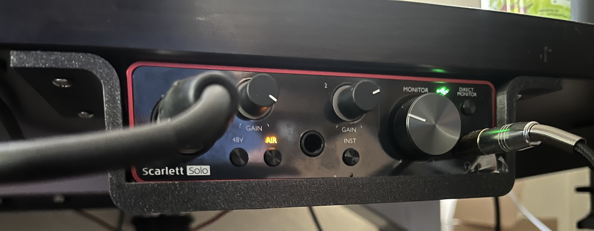
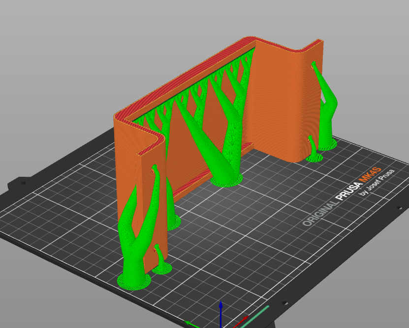

# Focusrite Scarlett Solo Mount

This is a basic mount for the audio mixer.

<picture>
  
</picture>

Print sideways and add supports for the holes and the one overhang on the tray.

<pictures>
  
</picture>

I just took the print to a hardware store and bought the screw that fit the hole and was deep enough to get into the desk without going too far.

The print is a tight fit for the unit, but it is snug and won't get in the way for the controls or ports.

## Printed with:
- Prusa Mk4S
- .4mm Nozzle
- .15mm Layer Height
- Used Organic Supports on PrusaSlicer

